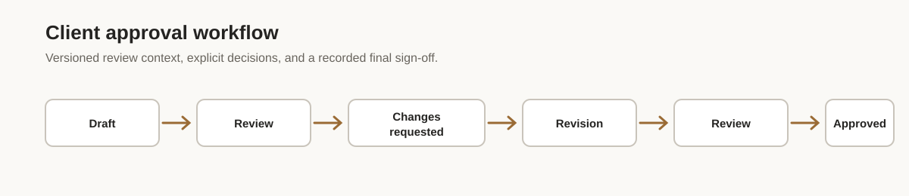

# Roundmark

Client approval workflows get complicated long before the UI does.

Roundmark is a source-code React kit for building client review, contextual feedback, revision rounds, and final approval directly into a product. It is a frontend workflow that you integrate into your application, not a hosted approval portal.

[Live Demo](https://roundmark.dev/demo/) · [Technical Guides](https://roundmark.dev/react-approval-workflow/) · [Get Roundmark](https://roundmark.dev)



This repository is a public technical showcase and overview only. The commercial Roundmark source code is **not included**. This is not an open-source edition and does not grant a license to the commercial source. Get the paid product at [roundmark.dev](https://roundmark.dev).

## Workflow at a glance

```text
Draft → Review → Changes Requested → Revision → Review → Approved
```

The important detail is that the second Review is a new review context for a new version. Approval of version 2 must not silently become approval of version 3.

## Why Approve / Reject is not enough

A boolean status loses the context developers and clients need:

- A decision belongs to a specific version and review round.
- Earlier versions remain inspectable instead of inheriting a later approval.
- Comments explain feedback; they are not reviewer decisions.
- Request changes must lead to a deliberate revision and resubmission path.
- An annotation needs stable context, such as normalized coordinates, when a responsive preview changes size.

The result is a workflow that can explain what was reviewed, who decided, and what should happen next.

## What Roundmark includes

Roundmark provides a client-side workflow and the source code needed to integrate and control it inside your product:

- React review workspace and approval/review components
- Workflow/domain model and lifecycle transitions
- Version history and review rounds
- Contextual comments, replies, and annotations
- Multi-reviewer decisions, request changes, and revision/resubmission UI
- Final approval states and an approval receipt
- Responsive UI and accessibility work
- Vite and Next.js integration guidance
- Three worked integration examples, documentation, and 238 buyer-facing tests

## Integration boundary

### Roundmark supplies

- Client-review UI
- Workflow/domain model and lifecycle transitions
- Versions and review rounds
- Annotations and comments/replies
- Reviewer decisions and request changes
- Revision/resubmission UI and final approval states
- Examples, documentation, and tests

### Your application supplies

- Backend and API routes
- Authentication and identity
- Persistence/database
- File and storage layer
- Notifications
- Application-specific authorization and business rules

Roundmark is backend-agnostic by design. Your application remains the authority for identity, access, persistence, and the assets being reviewed.

## Architecture overview

```text
Your App
   │
   ├── authentication and identity
   ├── backend / persistence
   ├── file storage and signed previews
   └── authorization and notifications
   │
   ▼
Roundmark integration boundary
   │
   ├── review workspace
   ├── versions and review rounds
   ├── comments / annotations
   ├── reviewer decisions
   └── approval lifecycle
```

The showcase intentionally stays at this public boundary. It does not reproduce the commercial state machine, selectors, reducers, geometry implementation, or test suite.

## Integration example

### Conceptual integration boundary

The exact integration details ship with Roundmark. This small shape shows the ownership boundary without inventing a public component API:

```tsx
// Conceptual only — exact integration details are included with Roundmark.
function ClientReviewScreen() {
  return (
    <YourAppShell>
      <RoundmarkReviewExperience />
    </YourAppShell>
  );
}
```

Your app loads the deliverable, authenticates the actor, persists workflow events, authorizes every mutation, and renders the preview asset. Roundmark presents the review experience and reports the user action at the integration boundary.

## Core workflow concepts

- **Version:** the exact deliverable a reviewer saw. A new revision gets a new version.
- **Review round:** the reviewer set and decisions for one version.
- **Annotation:** contextual feedback attached to a location in the reviewed preview.
- **Reviewer decision:** an explicit approval or request for changes, separate from comments.
- **Request changes:** a review outcome that opens a deliberate revision path.
- **Final approval:** a recorded sign-off for a specific approved version.

## Production-oriented details

Verified product facts:

- React 19 and TypeScript
- Tailwind CSS 4
- Responsive UI with accessibility work
- Vite and Next.js integration guidance
- Chromium, Firefox, and WebKit verification
- Three integration examples
- 238 buyer-facing tests
- Source code included with purchase
- Backend-agnostic integration model

## What Roundmark is not

Roundmark does not provide:

- Backend or authentication
- Database or persistence service
- File hosting, upload, or storage service
- Email or notification backend
- Realtime backend
- Billing
- SaaS hosting
- Customer accounts

It is licensed source code that you integrate and modify within your application.

## Build it yourself vs start with Roundmark

You can absolutely build this yourself. The work is coordinating version and round identity, contextual feedback, explicit reviewer decisions, revision semantics, responsive states, authorization, and the edge cases around historical work.

Roundmark is for teams that want a finished client-side workflow as source code while keeping their own backend, data, storage, and authorization decisions. The trade-off is ownership and integration work versus rebuilding the shared workflow foundation.

## Technical guides

These pages serve different intents:

- [React Approval Workflow for Client Review](https://roundmark.dev/react-approval-workflow/) — product and technical category overview
- [Client Approval Workflow for React](https://roundmark.dev/client-approval-workflow-react/) — client-facing review use cases
- [How to Build a Client Approval Workflow in React](https://roundmark.dev/build-client-approval-workflow-react/) — implementation tutorial

## Pricing

- **Individual — $99 one-time**
- **Team — $249 one-time**
- No subscription

See the current product details at [roundmark.dev](https://roundmark.dev). Checkout is handled by the website; this repository contains no purchase or payment integration.

## Live Demo

Explore the workflow in the [Roundmark live demo](https://roundmark.dev/demo/), then read the [technical guides](https://roundmark.dev/react-approval-workflow/) for the product boundary and implementation concepts.

## Commercial source

This repository contains public documentation and showcase material only. The commercial Roundmark source code is licensed separately under the [Roundmark Commercial License](https://roundmark.dev/license/).

For legal reference, see the public [Terms of Sale](https://roundmark.dev/terms/) and [Privacy Policy](https://roundmark.dev/privacy/).
